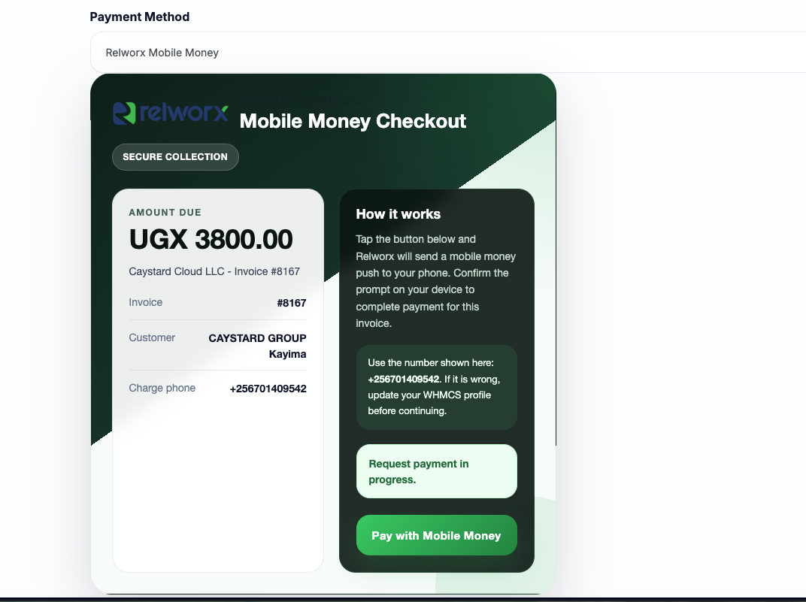

# Relworx WHMCS Gateway

Relworx Mobile Money payment gateway module for WHMCS.

## Preview



## Repository Layout

This repository is intentionally published without the top-level `gateways/` folder.

When installing into WHMCS, place the files like this:

```text
modules/gateways/relworxm.php
modules/gateways/callback/relworxm.php
modules/gateways/callback/processrelworxm.php
modules/gateways/relworxm/logo.png
modules/gateways/relworxm/whmcs.json
```

## Installation

1. Download or clone this repository.
2. Copy `relworxm.php` into `modules/gateways/`.
3. Copy the `callback/` folder contents into `modules/gateways/callback/`.
4. Copy the `relworxm/` folder into `modules/gateways/`.
5. Log in to your WHMCS admin area.
6. Go to `Setup > Payments > Payment Gateways`.
7. Activate `Relworx Mobile Money`.

## Configuration

After activation, enter:

- `Account ID`: Your Relworx account number
- `Secret Key`: Your Relworx API bearer secret

## Client Payment Flow

1. A client opens an unpaid invoice in WHMCS.
2. They choose `Relworx Mobile Money`.
3. WHMCS shows the Relworx payment card UI.
4. The client clicks `Pay with Mobile Money`.
5. Relworx sends a mobile money push prompt to the customer phone number saved in WHMCS.
6. The client approves the payment on their phone.
7. WHMCS marks the invoice as paid after the callback is received.

## Important Notes

- The client phone number is built from the WHMCS client phone country code and phone number.
- Make sure your WHMCS `System URL` is correct so the callback request path resolves properly.
- Ensure your server can make outbound HTTPS requests to `https://payments.relworx.com`.
- Test the module in a staging WHMCS instance before using it in production.

## Updating an Existing Install

Replace these files in your WHMCS installation:

- `modules/gateways/relworxm.php`
- `modules/gateways/callback/processrelworxm.php`
- `modules/gateways/callback/relworxm.php`
- `modules/gateways/relworxm/logo.png`
- `modules/gateways/relworxm/whmcs.json`

## License

Check the repository `LICENSE` file for the license applied to this project.
